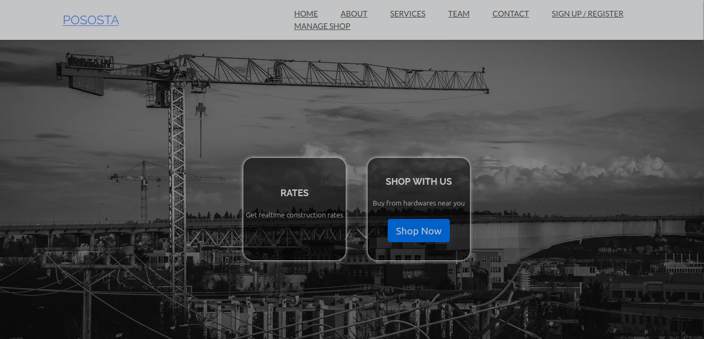
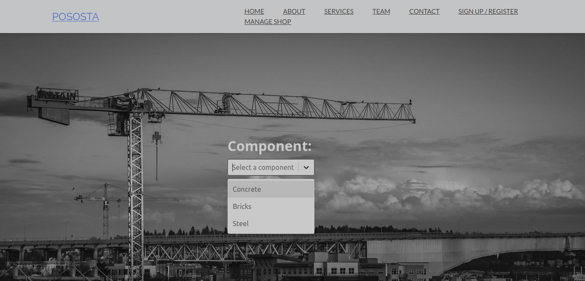
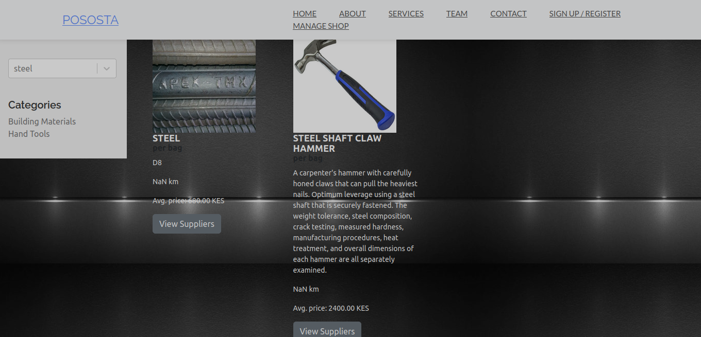
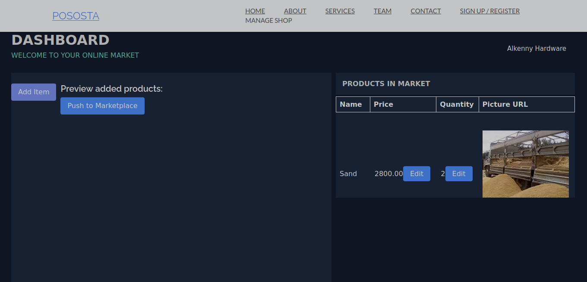

# Construction Rates and Hardware Shop React App

Welcome to the Construction Rates and Hardware Shop React App! This application provides tools for calculating rates for construction items such as concrete and steel, offers a hardware-styled e-commerce page to shop for components, and allows users to manage their own shops and products.

## Table of Contents

- [Features](#features)
- [Live Demo](#live-demo)
- [Installation](#installation)
- [Usage](#usage)
- [Screenshots](#screenshots)
- [Contributing](#contributing)
- [License](#license)

## Features

1. **Rates Page**: Calculate rates for construction items like concrete and steel.
2. **Shop Page**: Browse hardware components in an e-commerce-style shop.
3. **Manage Shop Page**: Create your shop and manage products with customizable price and quantity.
4. **User-Friendly Interface**: Intuitive and responsive design for a seamless user experience.

## Live Demo

Check out the live demo of the app at [pososta.com](https://www.pososta.com).

## Installation


To run the app locally, follow these steps:

1. Clone the repository:

```git clone https://github.com/your-username/your-repo.git```

2. Navigate to the app's directory:

```cd construction-rates-hardware-shop```


3. Install dependencies:

```npm install```
    

## Usage

1. Start the development server:

```npm start```

2. Open your web browser and go to http://localhost:3000 to access the app.

Screenshots

    Landing Page
    

    Rates Page
    

    Shop Page
    
    Manage Shop Page
    

## Contributing

Contributions are welcome! Please follow these steps:

    1. Fork the repository.
   2. Create a new branch for your feature/fix:

```git checkout -b feature/my-feature```

3. Commit your changes and push to your fork:

```git commit -m "Add my feature"```

```git push origin feature/my-feature```

3. Create a pull request to the main repository.
